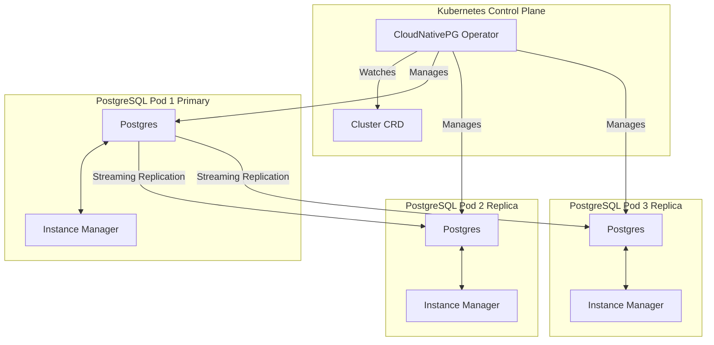
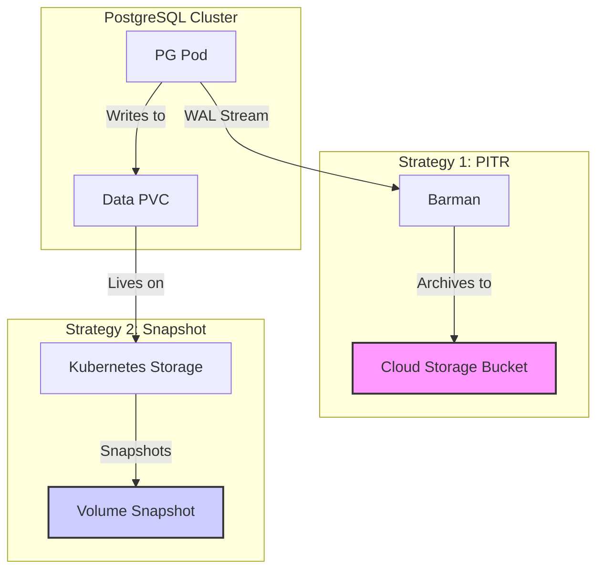
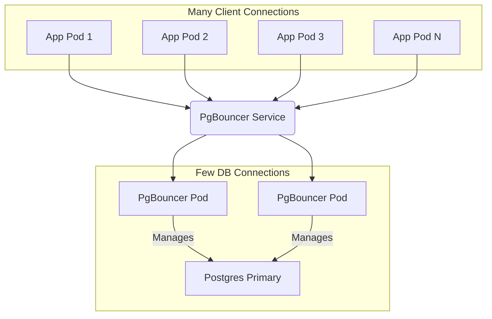

Have you ever felt the friction of running a traditional database like PostgreSQL in a modern Kubernetes environment? You're not alone. While Kubernetes excels at managing stateless applications, stateful workloads demand a different approach to handle high availability, backups, and scaling. This is where CloudNativePG changes the game. In this comprehensive guide, we'll move beyond theory and walk through the patterns for building a production-grade PostgreSQL infrastructure. Drawing from real-world use cases, this article covers everything from core architecture and Helm deployment to advanced connection pooling and disaster recovery. By the end, you'll have a practical blueprint for running PostgreSQL on Kubernetes with confidence and reliability.

## The CloudNativePG Architecture: Solving Real-World Problems

The power of CloudNativePG lies in its elegant operator-based architecture, which is specifically designed to solve the most common and painful challenges of running databases in Kubernetes.

At its core, it consists of two main components:

-   **The Operator:** A central controller that runs in your cluster, watching for `Cluster` custom resources. It is the "brain" of the operation, managing the high-level state and orchestrating complex workflows.
-   **The Instance Manager:** A sidecar container that runs in every PostgreSQL pod. It is the "hands" of the operation, acting as the operator's agent to perform tasks directly inside the pod, like managing the `postgres` process, handling replication, and reporting health.

This separation of concerns is key. The operator defines *what* needs to be done, while the instance manager knows *how* to do it safely for PostgreSQL. 

Here is a diagram illustrating this core architecture:



### How This Architecture Solves Key Challenges

This design directly addresses several major pain points, transforming complex manual tasks into automated, declarative operations.

| Challenge | The Manual Way (Without an Operator) | The CloudNativePG Solution | 
| :--- | :--- | :--- |
| **High Availability** | An admin is paged at 3 AM. They must manually verify the primary is down, select a replica, promote it, and re-point application connection strings. | The operator automatically detects primary failure, promotes the best replica, and updates K8s services for transparent application redirection. **Zero human intervention required.** |
| **Configuration Drift** | An admin uses `kubectl exec` to change `postgresql.conf` on one pod. The change is not tracked in Git, and the cluster is now in an inconsistent, unpredictable state. | The `Cluster` CRD is the single source of truth. The operator's reconciliation loop constantly enforces the configuration defined in Git, **eliminating drift entirely.** |
| **Day-2 Operations** | Scaling read replicas, performing minor version upgrades, or setting up new backup schedules are complex projects requiring careful planning and potential downtime. | These are simple, declarative changes to the `Cluster` YAML. Change `instances` from 3 to 5, and the operator safely provisions and integrates the new replicas. **Complex operations become trivial.** |
| **Application Discovery** | Applications need complex logic to handle failover, often hard-coding connection strings or requiring a separate service discovery mechanism to find the new primary. | The operator provides stable K8s services (e.g., `-rw` for the primary, `-ro` for replicas) that are automatically updated during failover. **Applications connect to a single, stable endpoint.** |

### Key Benefits of this Architecture

-   **Enhanced Resilience:** With automatic self-healing and failover, the system can recover from failures without human intervention.
-   **Consistency and Reproducibility:** By enforcing a declarative state, you ensure that your database environment is consistent and can be reproduced anywhere.
-   **Simplified Operations:** Complex database administration tasks are abstracted away and handled by the operator, freeing up developers and DBAs.
-   **Seamless K8s Integration:** Automatically manages services, endpoints, and monitoring resources, making the database a true first-class citizen in the Kubernetes ecosystem.
-   **Unified Control & Reduced Vendor Lock-in:** By running PostgreSQL inside Kubernetes, you can manage your database using the same tools (like `kubectl` and GitOps) as the rest of your applications. This provides a consistent operational experience and can significantly reduce costs and complexity compared to relying on external, cloud-provider-managed database services.

## Part 1: A Better Way to Install Helm Charts

A common and robust pattern for managing third-party software in Kubernetes is to use a "Wrapper Chart" (or "Umbrella Chart"). Instead of installing the official CloudNativePG Helm chart directly, you create your own Helm chart that lists the public chart as a dependency.

An example `Chart.yaml` for such a wrapper chart would look like this:

```yaml
# apiVersion: v2
# name: my-database-operator
# description: An internal chart to manage the PostgreSQL operator

# dependencies:
#   - name: cloudnative-pg
#     version: "0.23.0" # Pinning to a specific version
#     repository: "https://cloudnative-pg.github.io/charts"
```

This approach is a deliberate architectural choice that offers several key advantages.

### The Wrapper Chart Advantage

1.  **Centralized & Version-Controlled Configuration:** All of your environment-specific configurations (`values-local.yaml`, `values-dev.yaml`, `values-prod.yaml`) are stored and versioned in your own Git repository. The database configuration becomes a managed part of your application's infrastructure-as-code.

2.  **Deployment Stability and Predictability:** By pinning the dependency to an exact version (e.g., `0.23.0`), you ensure that deployments are repeatable. You are protected from unexpected breaking changes that could be introduced in a newer version of the public chart. Upgrades can then be tested and validated on your own schedule.

3.  **Abstraction and a Simplified Interface:** The official chart might have hundreds of values. A wrapper chart can create a much simpler interface. For example, a single flag in your `values.yaml` like `disasterRecoveryEnabled: true` could be used to enable and configure a dozen complex, underlying values for backups and retention policies.

4.  **Extensibility with Custom Resources:** A wrapper chart allows you to bundle your own custom resources (like a `NetworkPolicy` or a `PodMonitor`) with the third-party application by adding them to the `templates/` directory.

Adopting this pattern treats the database operator not as a separate, manually-installed tool, but as a true, version-controlled component of your application stack.

## Part 2: Deploying a Production-Ready PostgreSQL Cluster

With the operator running, you can define a database using a `Cluster` manifest. Here is a typical example of what a `postgres-cluster.yaml` file might look like.

```yaml
# Example postgres-cluster.yaml
apiVersion: postgresql.cnpg.io/v1
kind: Cluster
metadata:
  name: production-db-cluster
spec:
  description: "Production Database Cluster"
  imageName: "registry.my-company.com/postgres:15.3"
  instances: 3
  primaryUpdateStrategy: unsupervised
  
  storage:
    storageClass: "premium-ssd"
    size: "100Gi"
  walStorage:
    storageClass: "ultra-ssd"
    size: "20Gi"

  bootstrap:
    initdb:
      database: "app_db"
      owner: "app_user"
      options:
        - "--auth-host=scram-sha-256"

  monitoring:
    enablePodMonitor: true
```

### Key Configuration Deep Dive:

1.  **High Availability (`instances` & `primaryUpdateStrategy`):**
    Setting `instances: 3` creates a three-node cluster (one primary, two standbys), as shown below. The `primaryUpdateStrategy: unsupervised` setting instructs the operator to perform rolling updates by terminating and recreating the primary pod directly, relying on the subsequent automatic failover to a replica to minimize downtime.

    ```mermaid
    graph TD
        subgraph "PostgreSQL HA Cluster"
            Primary["Pod 1 (Primary)"]
            Replica1["Pod 2 (Replica)"]
            Replica2["Pod 3 (Replica)"]
        end

        App["Application Traffic"] --> Primary
        Primary -- Streaming Replication --> Replica1
        Primary -- Streaming Replication --> Replica2
        
        subgraph "On Failure"
            direction LR
            Primary -- Fails --> Operator
            Operator -- Promotes --> Replica1
            Replica1 -- Becomes --> NewPrimary["Pod 2 (New Primary)"]
        end
    ```

2.  **Storage (`storage` & `walStorage`):**
    Using separate Persistent Volume Claims (PVCs) for data and the Write-Ahead Log (WAL) is a common production pattern. Placing `walStorage` on your fastest `storageClass` can significantly improve write performance.

3.  **Security (`bootstrap` & `pg_hba`):**
    During bootstrap, it's wise to enforce strong authentication (`--auth-host=scram-sha-256`). CloudNativePG also allows you to define custom `pg_hba` rules directly in the `Cluster` spec to lock down network access, a highly recommended practice.

4.  **Performance Tuning (`postgresql.parameters`):**
    The `postgresql` block in the `Cluster` spec allows for deep tuning. Common production settings include:
    -   `synchronous_commit: off`: Can boost write throughput by allowing commits to return before the data is physically written to disk, at the risk of losing a few recent transactions in a crash.
    -   `autovacuum_vacuum_scale_factor: 0.02`: Triggers `VACUUM` more aggressively to reclaim space, which is vital for tables with high rates of updates and deletes.

## Part 3: Advanced Backup & Recovery Strategies

CloudNativePG excels at disaster recovery. A robust strategy often employs two complementary backup methods, as illustrated below:



1.  **`barmanObjectStore` for Point-in-Time-Recovery (PITR):**
    This method continuously archives WAL files to an object store (like S3, GCS, or Azure Blob Storage), enabling you to restore the database to any single point in time. It's the gold standard for protecting against data corruption.
    ```yaml
    # Example backup configuration in the Cluster spec
    # backup:
    #   barmanObjectStore:
    #     destinationPath: "s3://my-company-backups/prod-db/"
    #     # ... other options like encryption and credentials
    #   retentionPolicy: "14d"
    ```

2.  **`volumeSnapshot` for Fast Recovery:**
    This method uses the underlying storage provider's snapshot capabilities for near-instantaneous backups and restores of the entire data volume. It's perfect for quickly recovering from a major failure.

## Part 4: Connection Pooling with PgBouncer

To prevent connection exhaustion from microservices, CloudNativePG can deploy a highly available PgBouncer cluster via a `Pooler` resource. This funnels many client connections into a few efficient database connections.



-   **`type: rw` vs. `ro`**: It's common to deploy a `rw` pooler for the primary and a separate `ro` pooler for read-replicas, allowing you to easily scale read and write traffic.
-   **`poolMode: session`**: This mode is ideal for stateless services, as it provides a clean connection for the duration of a client session.

## Part 5: Monitoring with Prometheus

Observability is non-negotiable. By setting `monitoring.enablePodMonitor: true` in the `Cluster` spec, the operator automatically creates a `PodMonitor` resource. This instructs a Prometheus instance to scrape detailed metrics from the built-in exporter in each PostgreSQL pod, giving instant visibility into database health, performance, and replication status.

## Conclusion

CloudNativePG transforms PostgreSQL into a true cloud-native database. As this guide has demonstrated, it provides a declarative and automated framework that rivals—and in many ways exceeds—the capabilities of traditional managed cloud database services. By bringing the database *inside* Kubernetes, you not only gain powerful features like HA and automated backups, but you also unify your infrastructure, reduce vendor lock-in, and empower developers to manage the full application lifecycle. It allows you to confidently run your most critical stateful workloads, turning your Kubernetes cluster into a truly universal platform for all your applications.

### A Note from Infenia

At Infenia, we believe in leveraging the best of cloud-native technology to build robust and scalable applications. The patterns and best practices described in this guide are inspired by our real-world experiences, particularly from our work on the EasyMarry project, where we use CloudNativePG to harness the full potential of PostgreSQL on Kubernetes. We hope this guide empowers you to do the same.
